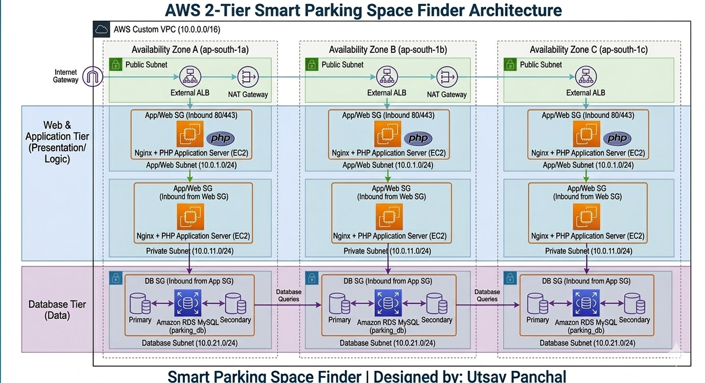

# 🚗 2-Tier Smart Parking Space Finder (AWS Cloud Infrastructure)

A lightweight, real-time **Smart Parking Space Finder** built using a robust **2-Tier Architecture**. This project is optimized for seamless local deployment using XAMPP and structured for automated high-availability deployment on **AWS (Amazon Web Services)**.

---

## 📐 Architecture Overview
This application follows the industry-standard **2-Tier Architecture**:



1. **Presentation & Application Tier (Web Server):**
   * Built with **HTML5, Bootstrap 5, and JavaScript** for a clean, responsive UI.
   * Powered by **PHP** to handle backend business logic and secure query parameters.
   * Hosted inside the **Public Subnet** of AWS EC2.

2. **Database Tier (Data Layer):**
   * Utilizes **MySQL** for robust relational data persistence.
   * Isolated inside the **Private Subnet** of AWS RDS to prevent direct internet exposure.

---

## 🗄️ Database Schema & Initial Seeding (phpMyAdmin Code)
Create a database named `smart_parking_db` in phpMyAdmin or AWS RDS, and run the following queries to automatically structure the schema and seed core locations like **Vastral**:

```sql
-- 1. Create Areas Table
CREATE TABLE IF NOT EXISTS `areas` (
  `id` INT AUTO_INCREMENT PRIMARY KEY,
  `area_name` VARCHAR(100) NOT NULL,
  `total_slots` INT NOT NULL
) ENGINE=InnoDB DEFAULT CHARSET=utf8mb4;

-- Seeding Default Areas (Vastral is ID: 1, leading by default)
INSERT INTO `areas` (`id`, `area_name`, `total_slots`) VALUES
(1, 'Vastral (Ahmedabad)', 4),
(2, 'Sindhu Bhavan Road (SBR)', 4),
(3, 'C G Road', 4),
(4, 'SG Highway (Near Iscon)', 4),
(5, 'Maninagar (Kankaria)', 4),
(6, 'Law Garden', 4);

-- 2. Create Parking Slots Table
CREATE TABLE IF NOT EXISTS `parking_slots` (
  `id` INT AUTO_INCREMENT PRIMARY KEY,
  `area_id` INT NOT NULL,
  `slot_number` VARCHAR(10) NOT NULL,
  `status` ENUM('Available', 'Booked') DEFAULT 'Available',
  FOREIGN KEY (`area_id`) REFERENCES `areas`(`id`) ON DELETE CASCADE
) ENGINE=InnoDB DEFAULT CHARSET=utf8mb4;

-- Seeding Slots for Vastral and Core Hubs
INSERT INTO `parking_slots` (`area_id`, `slot_number`, `status`) VALUES
(1, 'V-A1', 'Available'), (1, 'V-A2', 'Booked'), (1, 'V-B1', 'Available'), (1, 'V-B2', 'Available'),
(2, 'SBR-01', 'Available'), (2, 'SBR-02', 'Available'), (2, 'SBR-03', 'Available'), (2, 'SBR-04', 'Available'),
(3, 'CG-01', 'Available'), (3, 'CG-02', 'Available'), (3, 'CG-03', 'Available'), (3, 'CG-04', 'Available');

-- 3. Create Bookings Table
CREATE TABLE IF NOT EXISTS `bookings` (
  `id` INT AUTO_INCREMENT PRIMARY KEY,
  `slot_id` INT NOT NULL,
  `vehicle_number` VARCHAR(20) NOT NULL,
  `booking_time` TIMESTAMP DEFAULT CURRENT_TIMESTAMP,
  FOREIGN KEY (`slot_id`) REFERENCES `parking_slots`(`id`) ON DELETE CASCADE
) ENGINE=InnoDB DEFAULT CHARSET=utf8mb4;

☁️ Step-by-Step AWS Cloud Deployment Guide
Follow these sequential environment steps to deploy the 2-Tier framework onto Amazon Web Services:

**Step 1: AWS Network (VPC) Setup**
Create a custom VPC with CIDR block 10.0.0.0/16.
Configure 2 Public Subnets (for Web Tier EC2 servers) across different Availability Zones.
Configure 2 Private Subnets (for isolated Database Tier) to ensure internal security routing.
Provision an Internet Gateway (IGW) and attach it to your custom VPC. Route public traffic (0.0.0.0/0) through the public route table.

**Step 2: Configure Security Groups (Firewall Rules)**
Set up network accessibility restrictions using dedicated Security Groups:

Security Group Name  	Traffic Type	  Port	        Allowed Source Scope
Web-Server-SG	        HTTP / HTTPS	   80 / 443	    0.0.0.0/0 (Global public access)
DB-Server-SG	        MYSQL/Aurora	  3306	        Custom -> Point directly to Web-Server-SG
**
Step 3: Launch Amazon RDS (MySQL Database)**

Create an RDS Subnet Group selecting only your configured Private Subnets.
Provision a MySQL Database instance (Free Tier / Dev template).
Enforce Public Accessibility -> NO to sandbox data fields.
Attach DB-Server-SG as the native firewall. Set initial database name to smart_parking_db.
**
Step 4: Provision Amazon EC2 & Deploy Code**

Launch an Ubuntu/Linux EC2 Instance inside your Public Subnet. Attach Web-Server-SG.
Connect via SSH and run core server runtime installations:
sudo apt update
sudo apt install apache2 php libapache2-mod-php php-mysql -y
Migrate project repository PHP scripts (index.php, book_slot.php, etc.) into /var/www/html/. 
Database Connection Configuration: Open db_config.php and swap localhost with the AWS RDS Endpoint string generated in your RDS console panel. Update username/password credentials accordingly.


